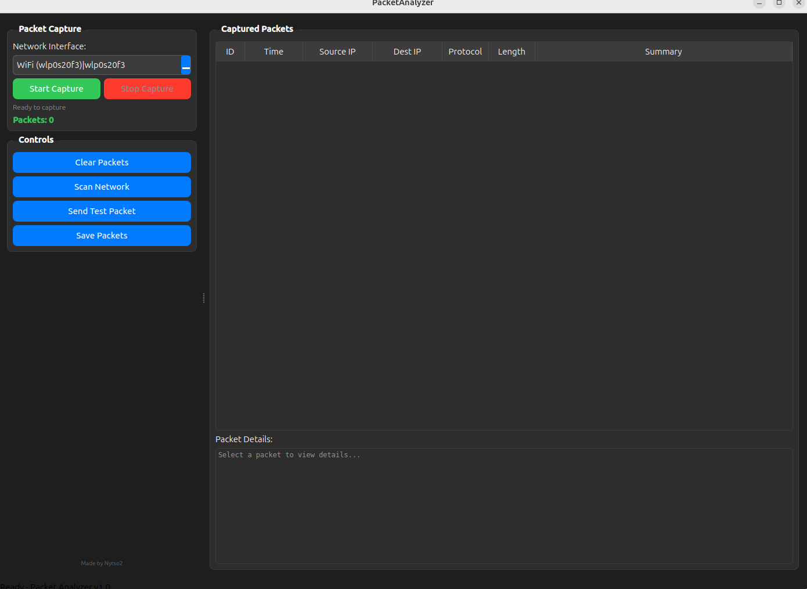

# 🔍 PacketAnalyzer

> A sleek, professional network packet capture and analysis tool with real-time scanning capabilities

<div align="center">


**[Features](#-features) • [Installation](#-installation)**

</div>

---


## 🌟 Features

<table>
<tr>
<td width="50%">

### 📡 **Network Capture**
- ⚡ **Real-time packet monitoring** with libpcap
- 🔌 **Auto-detect network interfaces** (WiFi/Ethernet)
- 📊 **Live packet analysis** with protocol detection
- 💾 **Export capabilities** (JSON/TXT formats)

</td>
<td width="50%">

### 🌐 **Network Discovery** 
- 🗺️ **Fast nmap integration** for device scanning
- 🏷️ **MAC address detection** with vendor info
- 🎯 **Smart network range detection** (172.16.x.x support)
- 📋 **Clean, organized results** display

</td>
</tr>
</table>

### 🎨 **User Experience**
- 🌙 **Modern dark theme** interface
- ⚡ **Lightning-fast scanning** (5-10 seconds)
- 🧭 **Intuitive navigation** and controls
- 🔒 **Professional security tool** design

---

## 🚀 Installation

### Prerequisites
```bash
# Ubuntu/Debian
sudo apt update && sudo apt install qt6-base-dev libqt6widgets6 libpcap-dev nmap

# Arch Linux
sudo pacman -S qt6-base libpcap nmap

# Fedora/RHEL
sudo dnf install qt6-qtbase-devel libpcap-devel nmap
```
### Quick Setup
```bash
git clone https://github.com/Nytso2/PacketAnalyzer.git
cd PacketAnalyzer
qmake6 && make
sudo ./PacketAnalyzer  # Root required for packet capture
```
### Technical Stack

Framework: Qt6 with C++17
- Packet Engine: libpcap with multi-threading
- Network Scanner: nmap integration
- UI/UX: Custom dark theme with Qt Widgets
- Export: JSON and plaintext formats

### Requirements

- Qt 6.0+ - Modern C++ GUI framework
- libpcap - Low-level packet capture
- nmap - Network discovery tool
- Linux/Windows - Cross-platform support
- Root/Admin - Required for packet capture

### License
- This project is licensed under the MIT License - see the LICENSE file for details.
### NOTICE
- This tool is designed for educational purposes and authorized network analysis only. Users must ensure compliance with all applicable laws and regulations. 
